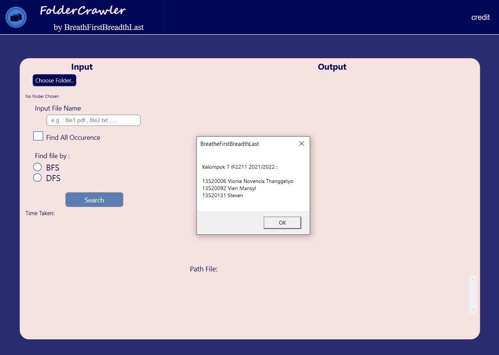
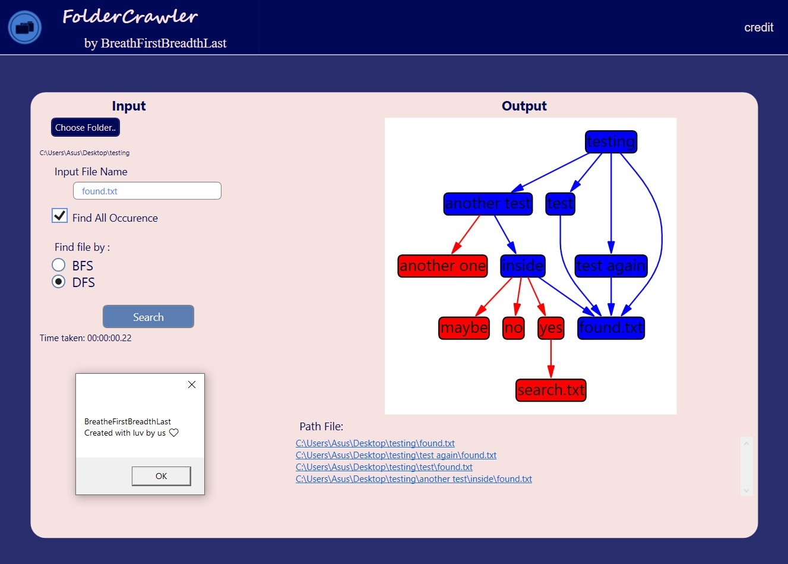

# Tugas Besar 2 IF2211 Strategi Algoritma

> Membangun sebuah aplikasi GUI sederhana yang dapat memodelkan fitur dari <em>file explorer</em> pada sistem operasi, yang pada tugas ini disebut dengan <em>Folder Crawling</em>. Fitur pencarian aplikasi ini memanfaatkan algoritma <em>Breadth First Search</em> (BFS) dan <em>Depth First Search</em>. Hasil pencarian aplikasi ini berupa visualisasi berbentuk pohon dan list <em>path</em> yang di mana <em>path</em> tersebut memiliki hyperlink yang akan menuju folder di mana file yang dicari tersebut berada.

## Daftar Anggota Kelompok

<table>

<tr><td colspan = 3 align = "center">KELOMPOK 07 BreatheFirstBreadthLater</td></tr>
<tr><td>No.</td><td>Nama</td><td>NIM</td></tr>
<tr><td>2.</td><td>Vionie Novencia Thanggestyo</td><td>13520006</td></tr>
<tr><td>1.</td><td>Vieri Mansyl</td><td>13520092</td></tr>
<tr><td>3.</td><td>Steven</td><td>13520131</td></tr>

</table>

## Teknologi dan Library yang Digunakan

- C#
- DOTNET
  - WPF
    - XAML
- MSAGL

## Cara Memakai

### Cara 1

1. Download atau clone repo ini
2. Buka folder bin
3. Double click file run.bat

### Cara 2

1. Download atau clone repo ini
2. Jalankan CMD
3. Masuk ke dalam folder bin
4. Ketikkan command
   ```
   run.bat
   ```

### Cara 3

<strong>NOTE : </strong>Requires [DOTNET](https://download.visualstudio.microsoft.com/download/pr/1eb43f77-61af-40b0-8a5a-6165724dca60/f12aac6d4a907b4d54f5d41317aae0f7/dotnet-sdk-6.0.201-win-x64.exe)

1. Download atau clone repo ini
2. Jalankan CMD
3. Masuk ke dalam folder src
4. Ketikkan command
   ```
   dotnet run
   ```

## Tampilan GUI Aplikasi BreatheFirstBreadthLater

### Tampilan Awal



### Tampilan Akhir



## Ucapan Terima Kasih

Atas bimbingan dan kesempatannya, kami mengucapkan terima kasih kepada

- Dr. Masayu Leylia Khodra (Dosen K1 IF2211 Tahun 2021/2022)
- Dr. Nur Ulfa Maulidevi (Dosen K2 IF2211 Tahun 2021/2022)
- Dr. Rinaldi Munir (Dosen K3 IF2211 Tahun 2021/2022)
- Semua Asisten IF2211 Tahun 2021/2022
